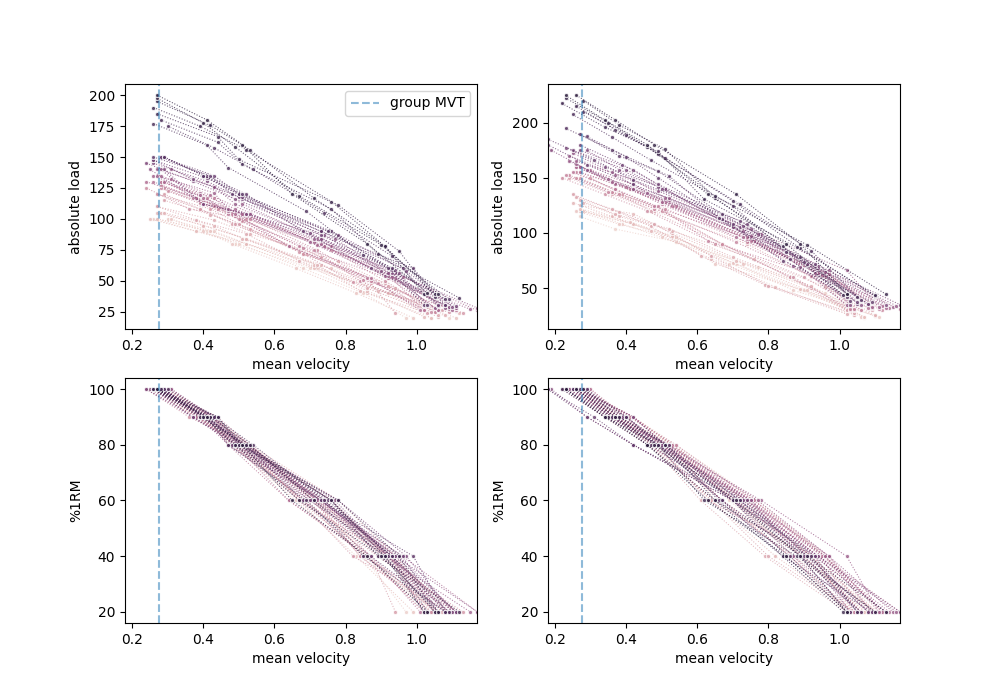
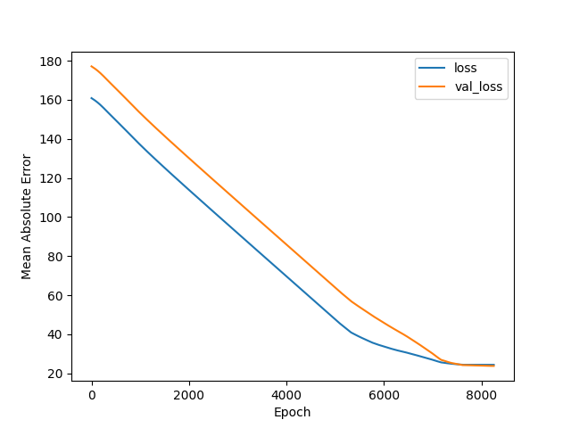
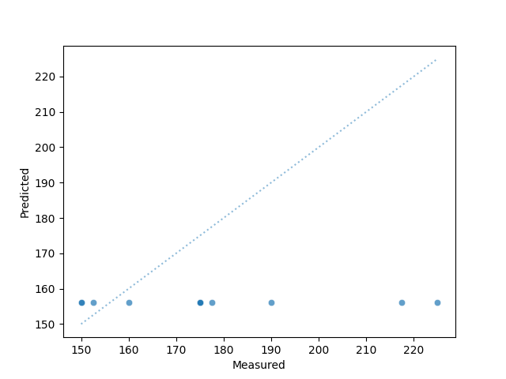
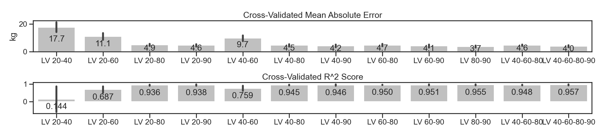

[**Click here to access the web app resulting from this project**](https://silvhua-lighthouse-capstone-project-srcapp-wafhso.streamlit.app/ )
# Goals
Maximal strength is measured using the maximum weight that one can use for a given exercise, known as the **1 repetition maximum (1RM)**. **This project aims to predict 1RM strength for the squat using data from lifting loads below 1RM**. 1RM strength is the key performance indicator by which Olympic weightlifters and powerlifters are evaluated. Other athletes and exercisers may also want to estimate 1RM strength in order to:
* Determine how much weight to use on a given training session. It is common for structured weight training programs to prescribe weight selection based on a percentage of 1RM.
* Enhance motivation, particularly with number-oriented individuals.

Testing 1RM, which involves lifting progressively heavier weight on a given exercise until nearing/reaching the point of failure, is inherently fatiguing and higher risk, particularly for an exercise such as the barbell squat. Additionally, achieving one's true 1RM on a given day is contingent on having optimal conditions such as low fatigue and the right psychological conditions. Whereas strength athletes test 1RM only a few times per year (often with lower training volume in the preceding weeks to reduce accumulated fatigue), submaximal testing can be performed frequently. 

For the reasons outlined above, competitive athletes and exercisers benefit from estimating their maximal strength (as indicated by 1RM) using submaximal loads (e.g. 80%). Athletes and exercisers use weight lifted to evaluate strength becauase it is an objective indicator of how much force the body exerts. **Concentric velocity** (i.e. movement speed when lifting the weight) is an additional objective indicator of force: Being able to move the same weight at a faster speed means that more force is being applied. 

An athlete can obtain a **load-velocity profile** by recording the mean concentric velocity for each of multiple submaximal loads (see figure 1 below). Statistical linear regression can then be used to estimate 1RM using the:
* slope of the load-volocity profile (**LV slope**),
* intercept of the load-velocity profile (**LV intercept**), and
* estimated or previously-measured velocity at 100% of the 1RM, known as the **minimum velocity threshold (MVT)**

Prediction of 1RM using the load-velocity profile assumes that even when the athlete's strength changes (which changes the LV slope and intercept), the MVT is constant. If the individual has no previous MVT measurement, MVT can be estimated using the a typical MVT value for that exercise from other individuals ([Balsalobre-Fernández and Kipp, 2021](https://doi.org/10.3390/sports9030039)).

**The overaching goal of this project is to use machine learning (ML) to develop a regression model for predicting 1 repetition maximum (1RM) strength for the free weight squat and Smith machine squat using submaximal weight** so that 1RM can be estimated reliably, safely, and frequently. This was done using load and velocity data during repetitions performed at submaximal loads with the intent to move at maximum concentric velocity. 

# Approach
Experiment 1 compared various non-ML and ML models. Experiment 2 compared various combinations of loads (ranging from 20-90% 1RM) for feature engineering, and compared a linear ML model with a random forest model. This project was performed using Python in VSCode with the Jupyter Notebook extension. Modules and packages include Pandas, Numpy, Matplotlib, Seaborn, Scikit-Learn, Keras/Tensorflow, and SciPy.

# Experiment 1
## Hypothesis

This project is based on a previous study by [Balsalobre-Fernández and Kipp (2021)](https://doi.org/10.3390/sports9030039), which had the same objective using the bench press exercise. Based on their findings, I hypothesize that:
* Machine learning models can allow for 1RM estimation for both the free weight (FW) squat and Smith machine (SM) squat using two features, (1) the slope and (2) y-intercept of the individual's load-velocity profile. In other words, machine learning allows for this estimation without knowledge of the concentric velocity during a 1RM load (MVT). 
* Linear regression machine learning (ML) models will allow for 1RM estimation with a lesser likelihood of overestimation than statistical machine learning models.

## Exploratory Data Analysis

Data for this project were provided by Dr. Carlos Balsalobre-Fernández from Universidad Autónoma de Madrid. Data were collected by researchers from 52 participants who each performed the FW squat and SM squat on separate days at various loads. Following a standardized warm up routine, participants performed the exercise 1-2 repetitions with their maximal intended velocity starting with a light weight, then with progressively higher weight until reaching their 1 repetition maximum. A total of 6 loads were used per participant per exercise and participants rested between each load to allow fatigue to dissipate. There were 2 data sets (1 for each of the FW squat and SM squat), each with 52 rows (1 per participant). The columns are as follows:
* `Participant ID`
* `Age`
* `Mass`
* `Height`
* `Load20%1RM` (weight in kg)
* `Load40%1RM`
* `Load60%1RM`
* `Load80%1RM`
* `Load90%1RM`
* `Load-1RM-1` (target variable)
* `20% MV` (`MV` = mean concentric velocity, in m/s)
* `40%MV`
* `60%MV`
* `80%MV`
* `90%MV`
* `100%MV`


### Original Features

Load-velocity profiles for all subjects are shown in this figure:



### Engineered Features

Univariate distributions and bivariate correlations of the features used for modelling are shown in the pairplots for the FW and SM squats below:


*FW squat*


 
*SM squat*


Limitations of the data:
* Results from Shapiro-Wilks tests indicated that the independent and dependent variables are not normally distributed (p<0.05). It is likely that with a larger sample size, the data would have a normal distribution. I decided not to attempt to reduce data skewness because it would make the results of the models less practical to apply for athletes and coaches. 
* The features used in modelling, LV slope and LV intercept, are collinear. Because the main goal in modelling is to predict 1RM with the smallest error for practical application, both features are retained in the models.


## Data Preparation

Minimal data cleaning were required as most of this was done by the researchers who conducted the experiments. During the exploratory data analysis, a data entry error was identified and corrected.

<details>
<summary>Expand for details of the data entry error. </summary>

The `Load80%1RM` feature used during data collection should be ~80% of the participant's `Load-1RM-1`. For one participant, the value was much lower than expected (0.8 x 197.5 = 177.75, but the value listed was 117.5), likely due to a data entry error. This incorrect value was replaced with 177.5 (closest weight increment to 80% of the `Load-1RM-1`) 

</details>

<br>

## Feature Engineering

For each individual and exercise, the slope  (`LV slope`) and y-intercept (`LV intercept`) of the load-velocity profile were obtained using a linear regression (Scikit-Learn's `LinearRegression` class) using loads equal to 40%, 60%, and 80% of the individual's 1RM (with load as the dependent variable of the regression). 

Below are the individual load velocity profiles and linear regression predictions for 8 participants:


## Modelling

The project aimed to find the model that would predict 1RM with the least error and with least likelihood of overestimation. Simple models were preferred to facilitate practical application by athletes and coaches.  Thus, linear regression models were selected over other regression models. 
The first experiment of the project aimed to replicate the 5 models used in the paper by Balsalobre-Fernández and Kipp (2021):

Model | Description | Model Independent Variable(s) 
--- | ---- | ---
Model 1: `Stat Ind MVT` | Statistical linear regression | **individual** MVT
Model 2: `Stat Grp MVT` | Statistical linear regression | **mean group** MVT
Model 3: `OLS` | Machine learning multilinear regression with ordinary least squares (OLS) | LV slope and LV intercept
Model 4: `Lasso` | Machine learning Lasso regression | LV slope and LV intercept
Model 5 | Neural network with 1 hidden layer of 10 nodes | LV slope and LV intercept

The second experiment used the ML linear regression with OLS (Model 3) and random forest regression. 
<br>

### Statistical Models (Models 1 & 2)
<br>

1RM was predicted using the following equation:

**1RM = LV_{slope} × MVT + LV_{intercept}**


For model 1, MVT was the mean velocity measured for the individual using the 1RM load. For model 2, MVT was the mean velocity for all participants for each exercise (0.27519 m/s for FW squat, 0.25558 m/s for SM squat). Model 2 thus allows for 1RM estimation even without the individual having ever performed 1RM testing, which would be necessary to determine the individual's MVT as required in Model 1.


<br>

### Machine Learning Models (Models 3-4)
<br>

ML learning regressions were implemented using Scikit-Learn's `LinearRegression` (Model 3, OLS) and `LassoCV` (Model 4) classes. Five-fold cross validation (CV) with 100 `alpha` values was used to determine the Lasso regression model regularization strength to use for model fitting. The alpha values of the optimized models are shown below:

Exercise | Alpha | CV iterations
--- | ---- | ---
FW squat | 1.11 | 72
SM squat | 1.11 | 72

With the exception of model 5, models in Experiment 1 were fit on data from all participants. 

<br>

### Neural Network
<br>

A Keras/Tensorflow neural network was compiled using a `Sequential` model with following architecture:
1. `Normalization` layer that receives 2 inputs, the LV slope and LV intercept, and normalizes the data.
2. `Dense` layer with `sigmoid` activation.
3. `Dense` hidden layer with 10 neurons with linear output.
4. `Dense` output layer with 1 neuron.

The code for the network is shown below:
```python
model = Sequential()
model.add(Normalization())
model.add(Dense(10, activation='sigmoid', input_shape=(X.shape[1],))) # Outputs to 10 hidden neurons
model.add(Dense(1))
model.compile(
    loss='mean_absolute_error',
    optimizer='adam',
    metrics=['mean_absolute_error']
)
```
The model was trained using the train sample and validated using the test sample (42 train samples, 10 test samples). To ensure that the train and test samples had similar mean target values, participants were ordered sequentially based on 1RM load on the free weight squat. Then, every 5th participant from the sample was selected for the test group. 

## Results
### Models 1-4
This figure shows 1RM predictions plotted against the measured 1RM values for each model (the equality line in orange is also shown for reference):


A few observations can be seen at first glance:
* Predictions from all models correlate highly with measured values. 
* There was more error with the SM squat predictions than with the FW squat predictions


Because the Pearson correlation coefficients (r) and coefficient of determination (R^2) for all models were similarly high (0.98-1.0), more practical evaluation metrics would be:
* Mean residual error: y_{predicted} - y_{measured}
* Mean absolute error (MAE): | y_{predicted} - y_{measured} |

The following figure of the residuals more clearly shows the magnitude and direction of prediction errors of the 4 models. Overestimated 1RM values are indicated by the red upward arrows. It is evident from this figure that the statistical models (`Stat ind MVT` and `Stat grp MVT`; models shown on the two left columns) overall had greater tendencies to overestimate 1RM values than the ML models (`OLS` and `Lasso`; models shown on the two right columns).


 
 
<br>

These errors are quantified below for each model and exercise (error bars represent 95% confidence intervals):


Based on the error values (blue bars), the statistical models (`Stat ind MVT` and `Stat grp MVT`) on average overestimate 1RM by 3.8-5.3 kg for each of the FW and SM squat, whereas the ML models (`OLS` and `Lasso`) are as equally likely to overpredict as they are to underpredict. 

Based on mean absolute error (MAE; red bars), ML models performed slightly better than the statistical models (error of 5.4-7.1 kg vs. 3.2-4.3 kg, respectively). Predicted 1RM values were compared with the measured 1RM values using paired t-tests. Predictions from the `OLS` and `Lasso` models were not significantly different from the measured values. However, predictions from the `Stat ind MVT` and `Stat grp MVT` models did significantly differ from measured values (p < 0.001, Cohen's d = 0.14-0.17).

. | Stat Ind MVT | Stat Grp MVT | OLS | Lasso 
--- | --- | --- | --- | --- | 
**FW Squat**
t statistic | -4.918 | -5.026 | 0.000 | 0.000
p-value | 0.000 | 0.000 | 1.000 | 1.000
Cohens d | 0.140 | 0.140 | 0.000 | 0.000
**SM Squat**
t statistic | -8.879 | -5.847 | -0.00 | -0.00
p-value | 0.000 | 0.000 | 1.000 | 1.000
Cohens d | 0.170 | 0.170 | 0.000 | 0.000

### Neural Network (Model 5)

The neural network was trained using the Adam algorithm (a stochastic gradient descent method) to minimize mean absolute error and to stop once this loss metric stopped improving after 50 epochs. Below are the results of this model:

Model Performance History | Measured 1RM vs. Predictions
--- | ---
 | 

Since the predictions were almost the same value across all participants, this model's predictions are not of practical use.


# Experiment 2
Given that the ML models used in this project only required the LV slope and LV intercept, only two data points per participant are theoretically required to engineer the model features. This time, instead of determining LV slope and LV intercept based on loads at 40%, 60%, and 80%  of 1RM, these were determined using various combinations of a subset of the loads (e.g. 40% and 60% 1RM).

The aims of this experiment were to determine:
1. Which two loads would provide the LV slopes and LV intercepts that would produce the 1RM predictions with the least error. 
2. Whether prediction error is affected by the number of data points used for estimating an individual's LV slope and LV intercept

It is hypothesized that:
1. Using moderate to heavy loads will provide the best estimates, since there will be less variability in the concentric velocity (as indicated in Figure 1, where there is greater variability in the data at lighter loads).
2. If the appropriate two loads are selected, using more data points to calculate LV slope and LV intercept won't meaningfully improve 1RM prediction.

## Data Preparation 
Each individual's LV slope and LV intercept were calculated using each of the following subsets of %1RM loads:
* 20% and 60%
* 20% and 80%
* 20% and 90%
* 40% and 60%
* 40% and 80%
* 60% and 80%
* 60% and 90%
* 80% and 90%
* 40%, 60, and 80%
* 40%, 60, 80, and 90%

Each set of LV slopes and LV intercepts were then used as features to fit the models.

In addition to selecting the OLS linear regression model based from Experiment 1 results, random forest models were also tested since random forest models are suitable for non-Gaussian data distributions and multicollinear independent variables. 
<details>
<summary>Expand for more details on Random Forest modelling </summary>

Initial modelling was performed using default hyperparameters (`n_estimators`=100 and `max_depth`=None; LV slope and LV intercept obtained from 40%, 60, and 80% 1RM loads). Grid search with 10-fold cross validation was then used to find the `n_estimators` and `max_depth` values resulting the the best R^2 score. 

</details>
<br>

## Results
### Model Selection
<br>
Using FW squat data, models were evaluated with the coefficient of determination (R^2) and mean absolute error (MAE) using 10-fold cross-validation. Results are plotted below:

<br>

*OLS Linear Regression*
 

*Random Forest Regression (`n_estimators`=20, `max_depth`=7)* 
 


Based on cross-validated MAE and R^2 scores, OLS linear regression models (3.0-10.9 MAE, 0.586-0.973 R^2) performed better than random forest models regardless of hyperparameter tuning (4.7-17.2 MAE, 0.147-0.926 R^2). Linear regression models are also more practical to implement. Thus, OLS linear regression models were used to determine which load combinations would result in the smallest prediction errors. 

<br>

### Load Selection for Determining Load Velocity Profiles

<br>

As hypothesized, predictions had lowest error when at least one of the loads used to calculate LV slope and LV intercept was 80% of 1RM or higher: For the FW squat, mean absolute error was 7.0-10.9 kg when all loads were < 80% 1RM vs. 3.0-3.7 kg when at least one of the loads was 80% or higher. The magnitude of the other load (e.g. 20% vs. 60%) had no meaningful impact. Additonally, as long as LV slope and LV intercept were calculated with one of the weights being ~80+ or more, using more than two data points did not meaningfully improve model predictions (MAE for the `LV 40-60-80-90` was the same as for `LV 40-80`).


<details>
<summary>Expand for figures from Smith machine squat </summary>




</details>


# Conclusions & Model Deployment
**Machine learning linear regressions allow athletes to predict 1RM using submaximal testing simply based on the LV profile; no estimation of minimum velocity threshold or prior 1RM testing is required**. These ML models perform at least as equally well as the statistical regression models that require MVT, and are less likely to overestimate 1RM for a given participant. The OLS and Lasso linear regressions performed equally well to each other. Furthermore, an individual's LV profile can simply be estimated using two data points as long as one of the loads is at least ~80%.  Based on results from experiment 1, the following regression equations can be used to estimate 1RM using these models:

Model | FW Squat | SM Squat
--- | ---- | ---
OLS | 0.6757 × LV_{slope} + 1.2618 × LV_{intercept} + 3.9407 | 0.5847 × LV_{slope} + 1.262 × LV_{intercept} - 7.6567
Lasso | 0.6533 × LV_{slope} + 1.2438 × LV_{intercept} + 4.1046 | 0.5675 × LV_{slope} + 1.2467 × LV_{intercept} - 7.2121

Given that the best performing models still had a mean absolute error of ~3kg, an athlete who wants to be conservative can subtract 3 kg (or more) from the estimated 1RM value.

Using these trained models, a web app has been created for users who want to use their load-velocity data to predict 1RM, or simply to compute and visualize the slope and intercept of their load-velocity profile. Users can input their data for 2-4 loads and one of the trained models will predict 1RM. The URL for the web app is https://silvhua-lighthouse-capstone-project-srcapp-wafhso.streamlit.app/ 

<details>
<summary>Expand for details on the app models </summary>

<br>

The app provides 1RM predictions using the trained `OLS` models. The number of load-velocity data points provided by the user determines which model is used for prediction:

Data points provided | Trained model | Model feature details
--- | --- | ---
2 | `LV 40-80` | `LV slope` and `LV intercept` of the training sample were determined using loads at 40% and 80% of 1RM
3 | `LV 40-60-80` | `LV slope` and `LV intercept` of the training sample were determined using loads at 40%, 60%, and 80% of 1RM
4 | `LV 40-60-80-90` | `LV slope` and `LV intercept` of the training sample were determined using loads at 40%, 60%, 80%, and 90% of 1RM


</details>
<br>

# Challenges
The nature of most exercise science research is that it is challenging to recruit a large number of participants. After discussing with a program mentor about the poor performance of the neural network model, I decided to focus on classic machine learning models, as neural networks require thousands of samples to work well. At the same time, having prediction models that don't require neural networks makes their use more accessible for the population at large.

Another limitation of the data is that the results will likely be different for individuals who are not similar to the population in this study: males ages 18-26 (21.7 ± 2.0 years) with a mean 1RM FW squat of 136.3 ± 27.0 kg.

# Possible Next Steps

Model accuracy would likely improve if accounting for other features of the participants, such as experience level with the exercise and anthropometrics. Additional research would be required to develop models for using LV profiles to predict 1RM strength for other exercises.