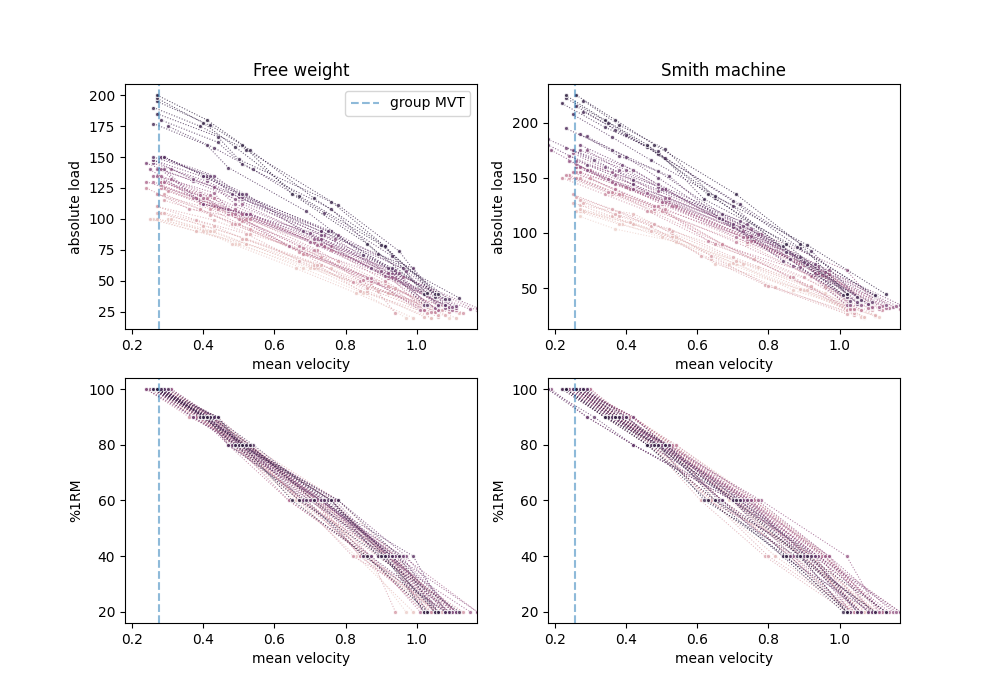

# Goals

Maximal strength is measured using the maximum weight that one can use for a given exercise, known as the **1 repetition maximum (1RM)**. 1RM strength is the key performance indicator by which Olympic weightlifters and powerlifters are evaluated. Other athletes and exercisers may also want to estimate 1RM strength in order to:
* Determine how much weight to use on a given training session. It is common for structured training programs to prescribe weight selection based on a percentage of 1RM.
* Enhance motivation, particularly with number-oriented individuals.

Testing one's 1RM, which involves progressively increasing weight on a given exercise until reaching the point of failure, is inherently fatiguing and higher risk, particularly for an exercise such as the barbell squat. Additionally, achieving one's true 1RM on a given day is contingent on having optimal conditions such as low fatigue and the right psychological conditions. Whereas strength athletes test 1RM only a few times per year, often with a period of lower training volume in the preceding weeks to allow fatigue to dissipate for full expression of strength, submaximal testing can be performed frequently. 

For the reasons outlined above, competitive athletes and exercisers benefit from estimating their maximal strength (as indicated by 1RM) using submaximal loads (e.g. 80%). Athletes and exercisers use weight lifted to evaluate strength as it is is an objective indicator of how much force the body is exerting. **Concentric velocity** (i.e. movement speed when lifting the weight) is an additional objective indicator of force: Being able to move the same weight at a faster speed means that more force is being applied. Athletes who track their concentric velocities during testing with 1RM and submaximal loads can then create a **load-velocity profile** (see figure 1 below) using statistical linear regression to then estimate 1RM in the future using:
* Slope of the load-volocity profile (**LV slope**).
* Intercept of the load-velocity profile (**LV intercept**).
* Estimated or previously-measured velocity at 100% of the 1RM, known as the **minimum velocity threshold (MVT)**

Subsequent prediction of 1RM using a load-velocity profile assumes that even when the athlete's strength changes (which changes the LV slope and intercept) the MVT is constant. 

The goal of this project is to use machine learning (ML) to develop a regression model for predicting 1 repetition maximum (1RM) strength for the free weight squat and Smith machine squat using submaximal weight, even without knowledge of MVT (unlike with statistical regression methods). This was done using load and velocity data during repetitions performed at submaximal loads with the intent to move at maximum concentric velocity. 

# Hypothesis

This project is based on a previous study by [Balsalobre-Fernández and Kipp (2021)](https://doi.org/10.3390/sports9030039), which had the same objective using the bench press exercise. Based on their findings, I hypothesize that:
* Machine learning models can allow for 1RM estimation for both the free weight (FW) squat and Smith machine (SM) squat using two features, the slope and y-intercept of the individual's load-velocity profile, without knowledge of the concentric velocity during a 1RM load (MVT). 
* Linear regression machine learning (ML) models will allow for 1RM estimation with a lesser likelihood of overestimation than statistical machine learning models

# Exploratory Data Analysis

Data for this project were provided by Dr. Carlos Balsalobre-Fernández from Universidad Autónoma de Madrid. Data were collected by *[name of authors who performed the experiments]* with 52 participants who each performed the FW squat and SM squat at various loads. Participants were instructed to perform 1-2 repetitions with their maximal intended velocity.

Load-velocity profiles for all subjects are shown in this figure:


Univariate distributions and bivariate correlations of the features used for modelling are shown in the pairplots for the FW and SM squats below:


#### FW squat


#### SM squat


A limitation of the data is that the variables are not normally distributed. It is likely that with a larger sample size, the data would have a normal distribution. I decided not to transform the data to to reduce skewness because it would make the results of the models less practical to apply for athletes and coaches. 


# Process
This project was performed using Python in VSCode with the Jupyter Notebook extension. Modules and packages include Pandas, Numpy, Matplotlib, Seaborn, Scikit-Learn, and Keras/Tensorflow. 


## Data Preparation

Minimal data cleaning were required as most of this was done by the researchers who conducted the experiments. During the exploratory data analysis, a data entry error was identified and corrected.

<details>
<summary>Expand for details of the data entry error. </summary>
The `Load80%1RM` feature used during data collection should be ~80% of the participant's `Load-1RM-1`. For one participant, the value was much lower than expected (0.8 x 197.5 = 177.75, but the value listed was 117.5), likely due to a data entry error. This incorrect value was replaced with 177.5 (closest weight increment to 80% of the `Load-1RM-1`) 
</details>


## Feature Engineering

For each individual and exercise, the slope  (`LV slope`) and y-intercept (`LV intercept`) of the load-velocity profile were obtained using a linear regression (Scikit-Learn's `LinearRegression` class) using loads that ranged from 40-100% of the individual's 1RM (with load as the dependent variable of the regression). *Note: I now realize I should recalculate these features using just data from the 40-80% loads if replicating the previous study).*

Below are the load velocity profiles and linear regression predictions for 10 participants:


## Modelling

The first iteration of the project aimed to replicate the 5 models used in the paper by Balsalobre-Fernández and Kipp (2021):

Model | Description | Model Independent Variable(s) 
--- | ---- | ---
Model 1 | Statistical linear regression | **individual** MVT
Model 2 | Statistical linear regression | **mean group** MVT
Model 3 | ML multilinear regression with ordinary least squares (OLS) | LV slope and LV intercept
Model 4 | ML Lasso regression | LV slope and LV intercept
Model 5 | Neural network with 1 hidden layer of 10 nodes | LV slope and LV intercept

<br>

### Statistical Models (Models 1 & 2)
<br>

1RM was predicted using the following equation:
$$ 
1RM = LV_{slope} \times MVT + LV_{intercept}
$$ 

For model 1, MVT was the mean velocity measured for the individual using the 1RM load. For model 2, MVT was the mean velocity for all participants for each exercise (0.27519 m/s for FW squat, 0.25558 m/s for SM squat)


<br>

### Machine Learning Models (Models 3-4)
<br>

ML learning regressions were implemented using Scikit-Learn's `LinearRegression` (Model 3, OLS) and `LassoCV` (Model 4) classes. Five-fold cross validation (CV) with 100 `alpha` values was used to determine the Lasso regression model regularization strength to use for model fitting. The alpha values of the optimized models are shown below:

Exercise | Alpha | CV iterations
--- | ---- | ---
FW squat | 1.125 | 130
SM squat | 1.125 | 130

With the exception of model 5, the results reported in this document are from models fit on data for all participants. This was done to provide the regression equations with the smallest errors for practical application by athletes and coaches. 

Not shown in this report are results from the models fit using a train-test split (42 train samples, 10 test samples). To ensure that the train and test samples had similar mean target values, participants were ordered sequentially based on 1RM load on the free weight squat. Then, every 5th participant from the sample was selected for the test group. As expected, the error of the predictions in the test sample were greater in these models, but small enough to for the models to still have practical utility.
<br>

### Neural Network
<br>

A Keras/Tensorflow neural network was compiled using a `Sequential` model using following architecture:
1. `Normalization` layer that receives 2 inputs, the LV slope and LV intercept, and normalizes the data.
2. `Dense` layer with `sigmoid` activation.
3. `Dense` hidden layer with 10 neurons with linear output.
4. `Dense` output layer with 1 neuron.

The code for the network is shown below:
```python
model = Sequential()
if normalize:
    model.add(Normalization())
model.add(Dense(10, activation='sigmoid', input_shape=(X_test.shape[1],))) # Outputs to 10 hidden neurons
model.add(Dense(1))
model.compile(
    loss='mean_absolute_error',
    optimizer='adam',
    metrics=['mean_absolute_error']
)
```
The model was trained using the train sample and validated using the test sample (train-test split described in the previous section).

# Results
## Models 1-4
The 1RM predictions are plotted against the measured 1RM values in this along with the equality line:


A few observations can be seen at first glance:
* Predictions from all models correlate highly with measured values. 
* There was more error with the SM squat predictions than with the FW squat predictions


Because the Pearson correlation coefficients (r) and coefficient of determination ($ R^2 $) for all models were similarly high (0.98-1.0), more practical evaluation metrics would be:
* Mean error: $ y_{predicted} - y_{measured} $
* Mean absolute error (MAE): $ | y_{predicted} - y_{measured} | $

The graphs below display these evaluation metrics for each model and exercise:


Based on the error values (blue bars), the statistical models (`Stat ind MVT` and `Stat grp MVT`) on average overestimate 1RM by 2.6 kg for each of the FW and SM squat, whereas the ML models (`OLS` and `Lasso`) are as equally likely to overpredict as they are to underpredict. 

Based on mean absolute error (MAE; red bars), ML models performed slightly better than the statistical models (error of 2.0-3.4 kg vs. 3.0-4.4 kg).

## Neural Network (Model 5)

The neural network was trained using the Adam algorithm (a stochastic gradient descent method) to minimize mean absolute error and to stop once this loss metric stopped improving after 50 epochs. Below are the results of this model:


Given that all predictions were almost the same value, this model's predictions are not of practical use.


# Conclusions
Machine learning linear regressions allow athletes to predict 1RM using submaximal testing simply based on the LV profile; no estimation of minimum velocity threshold or prior 1RM testing is required. These ML models perform at least as equally well as the statistical regression models that require MVT, and are less likely to overestimate 1RM for a given participant. The OLS and Lasso linear regressions performed equally well to each other. The follow regression equations can be used to estimate 1RM using these models *[coefficients `a` and `b` to be filled in later]*:

Model | FW Squat | SM Squat
--- | ---- | ---
OLS | $ a\times LV_{slope} + b \times LV_{intercept} $ | $ a\times LV_{slope} + b \times LV_{intercept} $
Lasso | $ a\times LV_{slope} + b \times LV_{intercept} $ | $ a\times LV_{slope} + b \times LV_{intercept} $

Given errors of these models, an athlete who wants to be conservative can subtract 2-3 kg (or more) from the estimated 1RM value.

# Challenges
The nature of most exercise science research is that it is challenging to recruit a large number of participants. After discussing with a program mentor about the poor performance of the neural network model, I decided to focus on linear regression models, as neural networks require thousands of samples to work well. At the same time, having prediction models that don't require neural networks makes their use more accessible for the population at large.

Another limitation of the data is that the results will likely be different for individuals who are not similar to the population in this study: males ages 18-26 (21.7 ± 2.0 years) with a mean 1RM FW squat of 136.3 ± 27.0 kg.

# Future Goals
The current project determined the LV slope using loads at 40, 60, 80, 90, and 100%. Given that the ML models used in this project only required the LV slope and LV intercept, this can theoretically be calculated using two data points per participant. The next iteration will determine which two loads will provide most accurate LV regressions for predicting 1RM. It is hypothesized that using moderate to heavy loads will provide the best estimates, since there will be less variability in the concentric velocity (as indicated in Figure 1, where there is greater variability in the data at lighter loads).